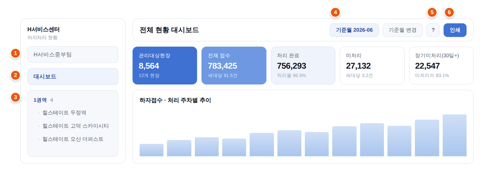
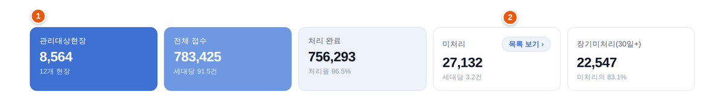
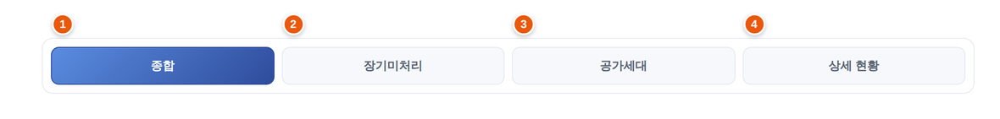
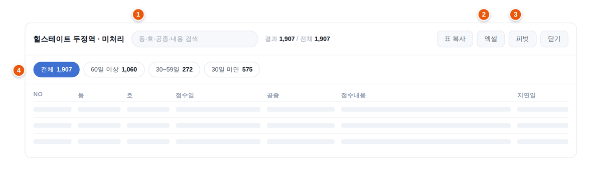

# 하자처리 현황 대시보드

**공동주택 하자보수 현황을, 팀 전체가 같은 화면으로.**

매달 HCS 「전체 하자 목록」 엑셀을 올리면 현장별·공종별 집계와 추이가 자동 생성.
담당자가 게시하면 팀원 전원이 같은 숫자를 열람하고, 월간 보고용 표·차트·분석 의견까지
한 화면에서 정리해 인쇄하거나 파일로 보관.

| 기능 | 하는 일 |
|---|---|
| **자동 집계** | 엑셀 1회 업로드 → 접수·처리·미처리·장기미처리를 기준월 말일 기준 계산 |
| **한눈에 파악** | 주차별 추이 · 전월 대비 · 공종/현장별 분포 · 장기미처리 상위 공종 |
| **팀 공유** | 게시 1회로 전원 실시간 열람 · 처리계획과 분석 의견은 공동 작성 |
| **기록 보관** | 스냅샷 파일 1개로 그달 상태 통째 보관·전달(로그인 불필요) |

- 접속: <https://dongyexn.github.io/report/>
- 가입: 회사 이메일(`@hdec.co.kr`) → 열람 권한 자동 부여

> **읽는 순서** — 1~4장 전 팀원용, 5장부터 운영·개발 담당자용.
> 처음이면 **1장 시작하기**만으로 충분.

---

## 1. 시작하기

### 로그인

- 접속 → 회사 이메일 가입 → 인증 메일 링크 클릭 → 로그인
- 가입 즉시 **열람 권한 자동 부여** · 별도 신청 불필요

### 화면 구성



| | 무엇 |
|---|---|
| **1** | **팀 선택** — 여러 팀 소속인 경우에만 표시 |
| **2** | **대시보드** — 팀 전체 합계 화면 |
| **3** | **현장 목록** — 권역별 묶음 · 이름 클릭 시 해당 현장으로 |
| **4** | **기준월** — 지금 보는 집계의 기준이 되는 달 |
| **5** | **사용 안내** — 이 문서 |
| **6** | **인쇄** — 현재 화면 인쇄 또는 PDF 저장 |

- 사이드바 접기 가능 · 접으면 아이콘만 표시(마우스 올리면 이름)
- 휴대폰·태블릿에서는 자동 숨김 → 왼쪽 위 메뉴 버튼으로 열기

### 대시보드

로그인 직후 화면. 우리 팀 전 현장 합계.



- 상단 **카드 5개** — 관리대상현장 · 전체 접수 · 처리 완료 · 미처리 · 장기미처리(**1**)
- 미처리·장기미처리 카드의 **「목록 보기」**(**2**) → 그 숫자를 이루는 실제 목록
- 이하 순서: 주차별 추이 → 전월 대비 실적 → 주요 이슈 → 월별·현장별 현황
- **주요 이슈 카드 클릭 → 펼쳐짐**(현장별·공종별 분해) · 재클릭 또는 `Esc`로 접기

### 현장 화면

사이드바에서 현장 클릭 → 상단 탭 5개.



| 탭 | 내용 |
|---|---|
| **종합** | 그 현장의 KPI · 추이 · 공종별 분포 · 분석 의견 |
| **장기미처리** | 30일 이상 경과 건 · 공종별 상위 · **처리계획 작성란** |
| **공가세대** | 빈집 상태로 남은 건 |
| **상가** | 상가 구분 건 |
| **상세 현황** | 월별·주차별 표(연도 선택 가능) |

---

## 2. 숫자 읽는 법

모든 숫자는 **기준월 말일** 기준.

| 용어 | 뜻 |
|---|---|
| **접수** | 그날까지 접수된 누계 |
| **처리 완료** | 보수 완료 처리된 누계 |
| **미처리** | 접수 − 처리 완료 |
| **장기미처리** | 미처리 중 접수 후 **30일 이상** 경과 |
| **지연일** | 접수일 ~ 기준월 말일 경과 일수 |
| **처리율** | 처리 완료 ÷ 접수 |
| **공가세대** | 입주 전이거나 비어 있는 세대 |

- 지연구간 3단 — **60일 이상** / **30~59일** / **30일 미만**
- 차트 색도 같은 구분(붉은 계열=장기, 파랑=30일 미만)
- 「인수 전 현장」 권역은 **대시보드 합계에서 제외**(현장 화면에서는 정상 표시)

---

## 3. 목록과 작성



### 목록 보기

- **검색**(**1**) — 동·호·공종·접수내용 즉시 필터
- **엑셀**(**2**) — 현재 목록 그대로 다운로드
- **피벗**(**3**) — 행·열·값을 골라 교차표 생성
- **지연구간 칩**(**4**) — 60일 이상 / 30~59일 / 30일 미만 전환
- 열 머리글 클릭 → 정렬 · **우클릭** → 값 선택 필터
- 열 경계 드래그 → 너비 조절

### 우클릭 메뉴

| 위치 | 기능 |
|---|---|
| 사이드바 현장 | 그 현장 바로 열기 |
| 공종 표 행 | 해당 공종 미처리·장기미처리 목록 |
| 일반 표 | 표 전체 복사(엑셀 붙여넣기용) |
| AI 분석 영역 | 텍스트 복사 · 재생성 |

### 함께 작성하기

- **처리계획** — 현장 > 장기미처리 탭의 공종별 입력란 · 열람자도 작성 가능
- **분석 의견** — 현장 > 종합 탭 하단 · 월별로 따로 보관
- 저장 즉시 팀 전체에 반영
- 「전월 계획 불러오기」 — 지난달 내용을 가져옴(이미 쓴 칸은 유지)

---

## 4. 자주 묻는 질문

**Q. 숫자가 어제와 다릅니다.**
담당자가 새 엑셀로 재게시한 것. 화면은 최신 게시본을 실시간 반영하며,
열람 중 갱신되면 「게시본이 갱신되었습니다」 안내 표시.

**Q. 접수내용에 `***`나 `○○님`이 보입니다.**
입주민 개인정보(전화·이메일·이름) 마스킹. 정상.

**Q. 기준월을 바꾸고 싶습니다.**
지난달도 게시되어 있으면 오른쪽 위에 월 선택 상자 표시.
게시월이 하나면 선택 상자 없이 기준월만 표시.
열람 중 새 달이 등록되면 「새로 등록되었습니다 · 열기」 안내.

**Q. 어떤 건 눌러도 수정이 안 됩니다.**
현장 정보·업로드·게시는 담당자 전용. 처리계획·분석 의견은 누구나 작성 가능.

**Q. 스냅샷 파일(.html)을 받았습니다.**
더블클릭 → 브라우저에서 열림. 로그인 불필요 · 내용은 만든 시점 고정.
여러 달을 담은 파일이면 오른쪽 위에서 기준월 전환 가능.
차트·압축 라이브러리를 파일에 포함하므로 **인터넷 없이 열림**.

**Q. 로딩 화면에서 멈춥니다.**
잠시 대기 후 `Ctrl+F5` 새로고침. 계속되면 담당자에게 연락.

**Q. 화면이 이상합니다.**
설정 > 표시 > **버전 · 오류 기록**의 `복사` → 담당자에게 전달.
어느 배포본에서 무슨 오류가 났는지 함께 담김.

**Q. 다크 모드는 어디서 켭니까.**
사이드바 맨 아래 프로필 줄 오른쪽 해/달 아이콘(설정 > 표시에도 있음).
이 PC의 브라우저에만 저장 · **인쇄물은 항상 밝게** 출력.

---

## 5. 권한과 계정

| 역할 | 할 수 있는 것 | 부여 방법 |
|---|---|---|
| `viewer` | 게시본 열람 + **처리계획·분석 의견 작성** | 회사 이메일 가입 시 자동 |
| `editor` | 위 전부 + 업로드·게시·현장/권역 관리·계정 관리 | 기존 편집자가 설정 > 계정 관리에서 변경 |
| `blocked` | 접근 차단 | 편집자가 지정 |

- 가입 조건 — `@hdec.co.kr` 이메일 + 메일 인증
- **자기 자신에게 편집자 권한 부여 불가**(권한 상승 차단)
- 최초 관리자 1명만 Firebase 콘솔에서 `users/{uid}/role = "editor"` 수동 설정

---

## 6. 월간 운영 루틴

1. HCS에서 「전체 하자 목록」 엑셀 다운로드(전 현장 통합본)
2. 업로드 → 자동 분배·파싱 → 업로드 요약(현장·건수·기간)을 원본과 대조
   - 필수 컬럼(접수일·처리상태·공종) 누락 시 차단
   - 그 외 표준 컬럼 누락 시 경고창 — HCS 컬럼명 변경 신호이므로 원본 헤더 확인 후 진행 판단
3. **기준월 확인** — 자동으로 전월 지정(당월 접수분이 섞여도 전월 상한)
4. 대시보드·현장 화면 검토 → 장기미처리 표에 **처리계획** 작성(「전월 계획 불러오기」 활용)
   → 월별 **분석 의견** 작성
5. 설정 > 사내 게시 > **등록**
   - 완료 안내의 **「스냅샷 저장」** 버튼으로 즉시 백업(원본은 마스터 PC에만 존재)
   - 기준월보다 미래인 게시월이 남아 있으면 삭제 제안이 대신 표시 → 잘못 게시된 월은 반드시 삭제
6. (권장) 설정 > **스냅샷 내보내기**로 백업 1부 보관 — 여러 달 합본 가능(8장)
7. 설정 > **뷰어 시점으로 보기**로 팀원 화면 최종 확인 → `F5`로 편집 모드 복귀

---

## 7. AI 분석

- 설정 > AI 분석에 **개인 Gemini API 키** 입력 → 「AI 분석 생성」·주요 이슈 재작성 활성화
- 키는 그 PC의 브라우저에만 저장
- 접수내용 등 자유 텍스트는 **개인정보 마스킹 후 전송**(전화·이메일·인명 호칭)
- 분석 규칙(작성 규칙·중대하자 키워드·장문 기준)은 코드에 고정(`RULE_DEF`·`CRIT_DEF`)
  - 변경하려면 코드 수정 후 배포
  - **형식 규칙(HTML·JSON 출력 구조)은 화면 렌더와 결합 — 내용 규칙만 손댈 것**
- 중대하자 판정은 2단 — 규칙이 후보를 넓게 추출 → AI가 사내 매뉴얼 기준으로 최종 판단

---

## 8. 스냅샷

설정 > 스냅샷 > **내보내기** → HTML 파일 1개.

- 기준 데이터는 **사내 게시본** — 팀원이 보는 집계·목록을 재계산 없이 담으므로 어느 PC에서 만들어도 동일
- 편집 모드에서 눌러도 게시본을 **조회만** 하므로 화면 모드 유지
- 네트워크 불가·미게시 시 그 PC의 로컬 데이터로 생성(토스트 안내)
- **여러 달 합본 가능** — 게시월이 둘 이상이면 옵션 창에 기준월 목록 표시
  - 두 달 이상 선택 시 파일 안에서 기준월 전환 가능
  - 담은 달 수만큼 파일 증가 → 필요한 달만 선택
- 파일 크기 — 월당 수백 KB~수 MB · 로그인 불필요
- 라이브러리 포함(약 240KB)이므로 **인터넷 없이 열림**
- 옵션 창에서 **글꼴 포함** 선택 가능
  - 포함 — 어느 PC에서든 화면과 같은 모양(파일 약 1.5MB 증가)
  - 미포함 — 그 PC의 기본 한글 글꼴로 표시
  - 선택은 다음 내보내기 기본값으로 기억

---

## 9. 구조와 데이터 흐름

```
HCS 엑셀 다운로드
   │  (편집자가 업로드)
   ▼
편집자 브라우저 IndexedDB  ←── 원본 하자 행은 여기에만 저장된다
   │  (calc: 기준월 말일 기준 집계)
   ▼
[게시] Firebase RTDB  report/{YYYY-MM}
   │  집계 KPI + 전체 미처리 목록(LZ 압축, PII 마스킹) + 주차/월별 캡처
   ▼
팀원 — 게시본을 실시간 구독해 열람
```

### 핵심 사실 셋

1. **원본 데이터는 서버에 없음** — 하자 행 원본은 업로드한 PC의 IndexedDB에만 존재.
   서버에는 월별 게시본(집계 + 마스킹 목록)만 저장.
   → **마스터 PC 한 대로 고정** · 그 PC의 브라우저 데이터 삭제 금지
2. **편집자 화면 = 로컬 계산 / 팀원 화면 = 게시본** — 다른 PC에서 로그인하면 그 PC의 로컬 원본으로 렌더.
   게시본 그대로 보려면 설정 > 「뷰어 시점으로 보기」
3. **기준월이 모든 계산의 축** — 지연일·장기미처리·누계 전부 기준월 말일 기준

### 파일 구성

| 파일 | 역할 |
|---|---|
| `index.html` | 마크업 + CSS(인라인 스크립트 없음) |
| `app/app-core.js` | 상태(S)·유틸·UI 원시함수(모달/토스트/차트색)·도메인 계산(calc)·계층 훅·`BUILD` |
| `app/app-data.js` | 저장소(IndexedDB)·Firebase 동기화/게시/뷰어·목록/피벗 모달·엑셀 내보내기 |
| `app/app-view.js` | 화면 렌더 — 내비게이션·대시보드·현장 패널·차트 |
| `app/app-boot.js` | 조립층 — 액션 등록·훅 수신·팀/현장 관리·업로드·설정·인쇄·부팅·스냅샷 |
| `vendor/` | 외부 자산 일체 — Chart.js·LZ-String·DOMPurify·marked·SheetJS·글꼴. **필수 배포** |
| `docs/guide-*.png` | 사용 안내 화면 이미지 |
| `tests/ci.mjs` | 셀프테스트·클릭 전수·집계 불변식·스냅샷 왕복·테마/인쇄 검증 |
| `tests/deps.mjs` | 계층 호출 방향 · 훅 이름 짝 검사 |
| `tests/build.mjs` | 배포 파일 변경 시 `BUILD` 갱신 여부 검사 |
| `.github/workflows/verify.yml` | push·PR마다 위 검증 자동 실행 |
| `database.rules.json` | RTDB 보안 규칙 |
| `README.md` | 이 문서 — 앱의 `?` 버튼에서 그대로 렌더 |

### 지켜야 할 규칙

- **로드 순서 = 호출 방향 = core → data → view → boot 한 방향**
  - 아래 계층이 위를 부를 일이 생기면 `fireHook('이름', ...)`으로 알리고,
    받는 쪽은 `app-boot.js`의 '훅 수신처'에 `onHook`으로 등록
  - `tests/deps.mjs`가 검사 — 어기면 CI 실패
- 순서 변경·파일 추가 시 `index.html`의 script 태그와 `app-boot.js`의 `APP_PARTS`를 **함께** 수정
- `index.html`과 `app/` 네 파일은 항상 **같은 커밋으로 배포**(직후 `Ctrl+F5`)
- **`vendor/` 폴더 반드시 함께 커밋** — 빠지면 라이브러리 404 → 압축 데이터를 못 읽어 원인 불명 오류
  (현재는 CDN 폴백 + 안내 토스트로 방어)
- 아이콘은 Lucide(ISC)를 `index.html`에 SVG 심볼로 인라인 · `<svg class="icn"><use href="#i-…">`
  - **외부 아이콘 파일·CDN 아이콘 폰트로 이전 금지** — 스냅샷(단일 파일)에서 사라짐
  - `.ic`는 주요 이슈 카드 클래스이므로 아이콘 클래스는 `.icn`
- SheetJS는 `vendor/` 우선, 없으면 CDN 폴백 —
  **폴백 존속 중 `readWorkbookSafe`의 프로토타입 오염 완화 코드 제거 금지**
- 스냅샷은 라이브러리를 파일에 인라인 —
  데이터 스크립트는 라이브러리 인라인 **이전에** 삽입(DOMPurify 본문의 `</head>` 오탐 방지)

---

## 10. 수정과 배포

1. 수정은 외과적으로 — 대규모 리라이트 금지 · 기존 주석·설계 의도 보존
2. **`app/app-core.js`의 `BUILD` 값 갱신**(예: `2026-07-25.1` → `.2`)
   - 미갱신 시 CI 실패 · 화면에 뜬 배포본을 구분할 수 없게 됨
3. 구문 검증 — `node --check`
4. 자체 점검 — 브라우저에서 `index.html?selftest=1` 전체 통과 확인
   - 로컬 전체 검증 — `node tests/ci.mjs`
   - push 시 GitHub Actions가 동일 검증 자동 실행
5. git push → GitHub Pages 반영(캐시로 수 분 소요 · `Ctrl+F5`)
6. **계산 로직 변경 시 재게시**해야 팀원 화면에 반영
7. 인터랙션 변경 시 실제 브라우저에서 해당 화면 확인 — 정적 검사로 안 잡히는 런타임 오류 이력 있음

### Firebase 운영

```bash
firebase deploy --only database                                                       # 규칙 배포
firebase emulators:exec --only database "node --test tests/database.rules.test.mjs"   # 규칙 테스트
```

- RTDB 최상위 노드 — `users` · `report/{YYYY-MM}` · `reportIndex` · `plans` · `analysis` · `meta` · `siteConfig`
  - 스키마 외 키는 규칙이 거부
- `plans`·`analysis`는 편집자·열람자 모두 쓰기 가능(협업) · 나머지 쓰기는 편집자 전용
- App Check(reCAPTCHA Enterprise) 사용
  - CSP `script-src`의 Google 계열 호스트(`www.google.com`·`www.gstatic.com`·`www.recaptcha.net`·
    `recaptcha.google.com`·`apis.google.com`) 중 하나라도 차단되면 토큰 재시도 루프로 진입 정지
- 사용자 관리는 설정 > 계정 관리에서 · 콘솔 직접 수정은 최초 부트스트랩 때만

---

## 11. 문제 해결

| 증상 | 원인 | 조치 |
|---|---|---|
| 로딩에서 멈춤 + 콘솔 CSP 차단 | `app/` 미배포 또는 reCAPTCHA 호스트 차단 | 콘솔의 차단 URL 확인 → 배포 여부·`script-src` 호스트 점검(20초 후 안내 표시) |
| 라이브러리 404 · 데이터 파싱 실패 | `vendor/` 미배포 | `vendor/` 폴더 커밋 확인(안내 토스트 동반) |
| 팀원 화면의 숫자·기준월 이상 | 잘못된 월의 구게시본 잔존 | 올바른 기준월로 재게시 → 미래 게시월 삭제 |
| 목록이 일부만 표시된다는 안내 | 전체 목록 도입 이전의 구게시본 | 최신 빌드에서 재게시 |
| 다른 PC에서 게시 내용이 안 보임 | 편집자 화면은 로컬 원본 기준(설계상 정상) | 설정 > 뷰어 시점으로 보기 |
| AI 분석 버튼 무반응 | Gemini API 키 미입력 | 설정 > AI 분석에 키 입력 |
| AI 분석 표시 깨짐 | 형식 규칙(HTML·JSON 출력) 오수정 | `RULE_DEF`의 형식 규칙 원복 후 재생성 |
| 엑셀 업로드가 조용히 어긋남 | HCS 컬럼명 변경 | 업로드 요약과 원본 대조 · 컬럼 매핑 수정(개발) |
| 사용 안내가 안 열림 | `README.md` 미배포 | 저장소 루트에 커밋 확인 |
| 스냅샷이 빈 화면·로그인 화면 | 인라인 스크립트가 CSP 해시와 불일치 | 파일 내 해시와 meta CSP 대조 → 재생성 |
| 스냅샷 글꼴 미적용 | `vendor/PretendardVariable.woff2` 미배포 | 해당 파일 커밋 확인(안내 토스트 동반) |

### 하지 말아야 할 것

- **마스터 PC의 브라우저 데이터(IndexedDB) 삭제 금지** — 원본 하자 행 소실
  - 삭제·PC 교체 전 HCS 원본 엑셀 보관과 스냅샷 백업 확인
  - 부팅 시 `navigator.storage.persist()`로 영속화를 요청하나 **백업을 대체하지 않음**
  - **월별 원본 엑셀 별도 보관이 원칙**
- `index.html`만 또는 `app/` 일부만 단독 배포 금지 — 항상 같은 커밋으로
- `database.rules.json` 스키마를 앱 수정 없이 단독 변경 금지 — 저장 구조와 결합
- 게시 목록의 PII 마스킹 제거 금지 — 입주민 개인정보가 전 팀원에게 노출
- 아이콘을 외부 스프라이트·CDN 폰트로 이전 금지 — 스냅샷에서 깨짐
- **형식 규칙(OUTPUT FORMAT — HTML·JSON 출력) 수정 금지** — 화면 렌더와 결합
  - 깨졌다면 즉시 기본값 복원

---

## 12. 인수인계 체크리스트

- [ ] Firebase 프로젝트 멤버 초대(콘솔 접근 확인)
- [ ] GitHub 저장소 권한 이양(Pages 설정 확인)
- [ ] 후임자 가입 → 기존 편집자가 역할을 `editor`로 변경
- [ ] 마스터 PC 지정 + 최신 HCS 엑셀·스냅샷 백업 전달
- [ ] 수정 → `?selftest=1` 검증 → 배포 절차 1회 동행(`BUILD` 갱신 포함)
- [ ] 월간 루틴(6장) 1주기 동행 운영
